# OAT Tools: Codebase Review & Onboarding Report

## 1. Executive Summary

### What Problem Does This Project Solve?
The `oat-tools` repository implements a content-and-asset publishing pipeline for **Owen's Applied Thinking (OAT)**. The core problem it solves is the friction, inconsistency, and risk of copyright/provenance loss when publishing media-heavy articles (such as on Substack or LinkedIn) or presentations (Marp carousels) written in Markdown. 

Specifically, it automates:
*   **Tabular Data Promotion**: Turning raw Markdown tables in drafts into accessible, beautifully styled Google Sheets, and rendering those tables as high-quality PNGs for seamless inline image embedding.
*   **Asset Ingestion and Provenance Tracking**: Capturing images from online sources (Unsplash, Pexels) or local environments (`~/Downloads`), ensuring authorship and license data are logged and persisted.
*   **Idempotent Placement Execution**: Moving images into the designated asset repository (`~/dev/images`), pushing changes to version control, and writing the final publishing markup directly into the Markdown source file.

### Who Are the Users?
The primary users are **OAT content creators, editors, and authors** (specifically Owen Corpening) who author articles in Markdown and coordinate multi-platform publication.

### What Are the Major Workflows?

```mermaid
flowchart TD
    subgraph Table Promotion Workflow
        T1[Parse markdown table in draft] --> T2[Create public Google Sheet via Worker]
        T2 --> T3[Render local HTML & screenshot via script]
        T3 --> T4[Commit PNG to asset repo]
        T4 --> T5[Replace table with figure snippet linking to Sheet & PNG]
    end

    subgraph Image Staging & Placement Workflow
        I1[Discover Image: Web Search / Downloads / AI Gen] --> I2[Capture metadata via Bookmarklet or Local Intake]
        I2 --> I3[Store record in D1 Ledger Worker as staged]
        I3 --> I4[Review staged assets in VS Code Sidebar]
        I4 --> I5[Place Figure: Choose Target substack/carousel/linkedin]
        I5 --> I6[Execute Saga: Copy/Download + Write Provenance + Git Push + Edit Draft]
    end
```


---

## 2. Monorepo Structure

The repository is structured as a monorepo containing two VS Code extensions, a shared database layer, cloud workers, and command-line tools.

### Top-Level Directories
*   `extensions/`: Holds the user-facing editor tools.
    *   `table-tools/`: Automates Markdown table parsing, Google Sheets creation, local HTML-based screenshot rendering, Git synchronization, and draft replacement.
    *   `image-staging/`: Implements the sidebar UI panel for staging queue management and orchestrates the image placement saga.
*   `tools/`: Standalone CLI utilities and infrastructure code.
    *   `assets/`: Audits final asset directories in the image repository for required license metadata.
    *   `blockquotes/`: Extract and render Markdown blockquotes into branded pull-quote cards.
    *   `bookmarklet/`: A web browser bookmarklet that allows authors to capture images directly from source pages and register them in the D1 ledger.
    *   `carousels/`: Wrapper for exporting Marp presentations into styled PDFs using brand CSS.
    *   `d1/`: Schema migrations and code for the Cloudflare D1-backed ledger Worker.
*   `docs/`: Architectures, use-cases, and refactoring strategies.

### Rationale for Monorepo Organization
1.  **Unified Workflow Domain**: All tools directly serve the OAT publishing process. Housing them together ensures changes in standards or schemas are implemented and tested across both extension environments simultaneously.
2.  **Shared Deployment Configuration**: Infrastructure orchestration (e.g., using `wrangler` for local D1 setups and Workers deployment, or packing extensions via `@vscode/vsce`) is consolidated under a single parent `package.json`.
3.  **Decoupled Runtime with Shared Management**: While the packages avoid bundling shared runtime modules (reducing dependency rot and load-time overhead for the extensions), they are developed, tested, and version-controlled side-by-side.

### Shared Packages and Dependencies
*   **Zero-Dependency Runtime**: The VS Code extensions use only Node.js built-ins and the VS Code API. No runtime `npm install` is required for extension execution.
*   **Shared Dev Tools**: The parent `package.json` specifies `wrangler` for local/remote database migrations and server hosting.
*   **Workspace Scripts**: Root-level shell scripts package the extensions (`npm run package:extensions`), install/uninstall them, and execute the test suites across all packages.

---

## 3. Component Responsibilities

### OAT Table Tools (`extensions/table-tools/`)
*   **Purpose**: Replaces Markdown tables in drafts with figure embeds linking to a public Google Sheet and showing a PNG preview.
*   **Inputs**:
    *   Active Markdown document text
    *   User inputs: Part number (e.g., `09`) and Series slug (e.g., `water-series`)
    *   Settings: `oatTables.workerUrl`, `oatTables.imagesRepoPath`, `oatTables.screenshotScriptPath`
*   **Outputs**:
    *   A public, OAT-styled Google Sheet.
    *   A table screenshot PNG committed and pushed to the images repo (`~/dev/images/generated/[series]/part-[part]/[title].png`).
    *   `<figure>` HTML markup in the editor.
*   **External Dependencies**: Cloudflare Worker (`oat-promote-tables`), local headless screenshot script, Google Drive/Sheets API, Git, Bash.
*   **Major Abstractions**:
    *   `parseTables.js`: RegEx-based parser identifying table boundaries, headers, and row data.
    *   `tableImageWidth.js`: Static estimator for image dimensions based on text length.

### OAT Image Staging (`extensions/image-staging/`)
*   **Purpose**: Manages staged images, verifies provenance, and embeds visuals into drafts.
*   **Inputs**:
    *   User commands (Intake URL, Intake Local File, Create Review Need).
    *   Ledger entries from the D1 API.
    *   Local files from `~/Downloads`.
*   **Outputs**:
    *   `asset`, `asset_placement`, and `image_need` records written to the database.
    *   Copied/downloaded image files and provenance text files (`url.txt`, `license.txt`, `photographer.txt`) placed in the asset repo.
    *   Markdown draft edits containing targeted figure snippets (HTML figures, Marp styles, or LinkedIn handoff text).
*   **External Dependencies**: D1 Ledger Worker API, local file system, Git.
*   **Major Abstractions**:
    *   `ImagePanelProvider`: Coordinates Webview view state, rendering thumbnails, searches, and buttons.
    *   `imagePipeline.placeAsset`: An idempotent 7-step saga coordinator executing database and local system updates.
    *   `downloadsProvider`: Scans, tokenizes, and extracts metadata/AI flags from the downloads folder.

### Publishing Ledger Worker (`tools/d1/worker/`)
*   **Purpose**: Serves as the central API layer for the D1 database, handling metadata normalization and query enrichment.
*   **Inputs**: HTTP requests containing captured URLs, raw metadata, or saga state changes.
*   **Outputs**: Database mutations, normalized JSON data, third-party provider searches.
*   **External Dependencies**: Cloudflare Workers, Cloudflare D1 database, Pexels API, Unsplash API.
*   **Major Abstractions**:
    *   `normalizeCapturedAsset`: Resolves authorship and licenses from known providers (like Unsplash/Pexels API keys).
    *   `normalizeProviderAsset`: Translates remote provider search results into standardized asset schemas.

### Bookmarklet (`tools/bookmarklet/`)
*   **Purpose**: Captures web image links, photographers, and licenses while browsing.
*   **Inputs**: Active browser page DOM.
*   **Outputs**: HTTP POST to `/captures/image` on the ledger worker.
*   **External Dependencies**: Browser JavaScript environment.

### Blockquote Renderer (`tools/blockquotes/`)
*   **Purpose**: Converts body blockquotes in drafts to styled brand image cards.
*   **Inputs**: Markdown post files, section and slug targets.
*   **Outputs**: Branded PNG card files in `[asset repo]/[section]/[slug]/blockquotes/`.
*   **External Dependencies**: Python 3, PIL (Pillow), system truetype fonts (Liberation Sans).

### Carousel Exporter (`tools/carousels/`)
*   **Purpose**: Renders presentation slides from Markdown.
*   **Inputs**: Markdown file, OAT Brand CSS theme.
*   **Outputs**: Exported PDF presentation file.
*   **External Dependencies**: Marp CLI.

### Asset Validator (`tools/assets/`)
*   **Purpose**: Verifies that folders containing images also contain required provenance metadata.
*   **Inputs**: Root asset repository directory.
*   **Outputs**: Audit logs highlighting missing `url.txt`, `license.txt`, or `photographer.txt` files.
*   **External Dependencies**: Node.js file system APIs.

---

## 4. Architecture

### 1. How the VS Code Extensions Work
Both extensions are built on top of the standard VS Code API:
*   **Command Registration**: Commands register handlers (e.g. `promoteAllTables`, `intakeLocalFile`) mapping to the Command Palette.
*   **UI Views**: `image-staging` utilizes a Webview View Provider registered in the VS Code Sidebar. The UI is written in vanilla HTML/CSS/JS. It requests data from the extension host via `postMessage()`, which makes outbound HTTPS requests to the Cloudflare D1 Worker or crawls the local `~/Downloads` folder.
*   **Editor Mutators**: Both extensions modify active text editors. They use `vscode.TextEditor.edit()` to construct transaction-safe replacements, ensuring editor operations can be reversed using the standard VS Code undo buffer (though this does not undo git commits or database mutations).

### 2. How the Cloudflare Workers Work
*   **Table promotion Worker (`oat-promote-tables`)**: Runs as a serverless fetch handler. It takes table inputs, fetches a fresh OAuth 2.0 access token via a stored Google refresh token, and issues v4 Sheets API calls. It formats headers (Deep Water Blue background, Arial white bold text), freeze-frames the top row, auto-resizes columns, and sets public reader access via the Drive API.
*   **Ledger Worker (`oat-publishing-ledger`)**: Routes HTTP requests using regular expression mapping. It binds to a Cloudflare D1 database instance. It performs metadata enrichment queries against Unsplash or Pexels APIs before writing asset records.

### 3. How D1 is Used
Cloudflare D1 is the relational database ledger. It maps the publishing state using the following tables:
*   `content_item`: The target publication (article, post).
*   `content_draft`: Working files pointing to Git directories.
*   `asset`: The media record (image, screenshot) owning hashes, licenses, and raw URLs.
*   `asset_placement`: The intersection joining an asset to a draft (stores snippets and status).
*   `image_need`: Review-time placeholders showing visual gaps.
*   `asset_saga`: Step-by-step state tracker.

> [!NOTE]
> Client-side UUIDs are generated during intake to enable offline operations and idempotent retries. D1 handles concurrency constraints using standard SQLite transaction semantics.

### 4. Data Flow Architecture
The diagram below shows the flow of an image from discovery to draft insertion:

```
[ Browser Bookmarklet ]         [ Downloads Folder ]        [ Provider Search ]
         │                              │                           │
         ▼ (HTTP POST)                  ▼ (Local Scan)              ▼ (API Query)
  [ D1 Ledger Worker ] ─────────► [ Staging Queue ] ◄──────── [ D1 Ledger Worker ]
                                        │
                                        ▼ (Click 'Place Figure')
                            [ 7-Step Saga Execution ]
                                        │
    ┌───────────────────────┬───────────┴───────────┬────────────────────────┐
    ▼                       ▼                       ▼                        ▼
[ Download Image ]   [ Write Metadata ]      [ Git Push ]             [ Insert Figure ]
Download from source  Write url/license      git commit & push        Embed HTML figure
to local asset repo   to text sidecars       to raw GitHub asset repo  into active editor
    │                       │                       │                        │
    └───────────────────────┴───────────┬───────────┴────────────────────────┘
                                        ▼
                            [ Update Placement Status ]
                             Set to 'placed' in D1
```

---

## 5. Developer Workflow

### Building the Project
*   Extensions are packaged as `.vsix` binaries using `@vscode/vsce`:
    ```bash
    npm run package:extensions
    ```
*   The bookmarklet is compiled into an obfuscated URI string:
    ```bash
    npm run bookmarklet:build
    ```

### Running Locally
1.  **Ledger API**: Serve the D1 worker locally using a custom Node SQLite server (bypasses wrangler's local D1 configuration limitations):
    ```bash
    npm run ledger:dev:node
    ```
    This auto-migrates the database and writes a local SQLite file to `tools/d1/worker/.wrangler/state/local-ledger.sqlite`.
2.  **VS Code Host**: 
    *   Open `oat-tools` in VS Code.
    *   Press `F5` to launch a new extension development host window with extensions pre-loaded, or manually link them to your local extensions directory:
        ```bash
        ln -s ~/dev/oat-tools/extensions/table-tools ~/.vscode/extensions/oat-table-tools-0.1.0
        ln -s ~/dev/oat-tools/extensions/image-staging ~/.vscode/extensions/oat-image-staging-0.1.0
        ```

### Testing
Verify JavaScript logic by executing all test suites (tests use basic Node assert modules):
```bash
npm test
```

### Deployment
*   **Workers**: Deploy wrangler workers to Cloudflare:
    ```bash
    cd tools/d1/worker && npx wrangler deploy
    cd extensions/table-tools/worker && npx wrangler deploy
    ```
*   **Database Migrations**: Apply schema updates:
    ```bash
    npm run ledger:migrations:apply:remote
    ```

---

### Missing or Unclear Documentation
1.  **Headless Screenshot Setup**: The screenshot utility `screenshot-html.sh` expects a screenshot CLI (e.g., `wraith` or headless chromium) to be installed locally, but the dependencies and install steps are undocumented.
2.  **OAuth Client Credentials Flow**: Setting up Google APIs for table promotion requires a Google Cloud project with OAuth credentials, but there is no guide detailing scopes or project permissions.
3.  **Local Dev Mocking**: The integration test profiles do not document how to mock Pexels or Unsplash credentials for sandbox execution.

---

## 6. Risks

### 1. Architectural Concerns
*   **Heavy Local Subprocess Coupling**: The pipeline heavily relies on shell invocations for Git operations (`git add/commit/push`), screenshots (`screenshot-html.sh`), and rendering (`python3 blockquote-renderer.py`). Variations in developers' local machines (shell versions, git hooks, python environments, or missing Liberation fonts) can easily break these features silently.
*   **SQLite Ledger Synchronization**: The Node local dev server does not synchronize state with remote D1 databases. Running testing setups locally creates a siloed history that can diverge from production states.
*   **Sync Blocking on Git Operations**: The table promotion pipeline blocks editor edits on `git push` runs. If the GitHub remote is slow or unreachable, it blocks editor UI responsiveness.

### 2. Technical Debt
*   **Redundant Modules**: Common features (like HTTP request wrappers `request.js` or logger utilities) are duplicated between `table-tools/lib` and `image-staging/lib`.
*   **Variable Coding Paradigms**: The codebase mixes CommonJS modules (`require`) in extension codes with ES Modules (`import/export`) in worker directories, which increases onboarding friction.
*   **Loose Settings Fallbacks**: Config readers look for both `oatTables.*` and legacy `oat.*` names. This backward-compatibility support complicates debugging config settings.

### 3. Growth Bottlenecks
*   **Downloads Folder Crawling**: Scanning the entire `~/Downloads` folder on every panel refresh will lag significantly if users do not clean out their downloads.
*   **Text-Based Asset Metadata**: Relying on individual `.txt` files (`url.txt`, `license.txt`) for provenance metadata will become hard to manage as properties grow (e.g., tags, dimensions, timestamp, resolution). A structured format (like `metadata.json`) is needed.

---

## 7. Recommendations

### Immediate Actions (Quick Wins)
1.  **Create a Setup Doctor Script**: Implement a script to verify local requirements (e.g., node version, python installations, git configurations, and required Liberation system fonts).
2.  **Refactor `~/Downloads` Scanner**: Limit downloads scanning depth, add pagination, or filter out files larger than a specified threshold to maintain sidebar performance.
3.  **Consolidate Configuration Readers**: Replace duplicated settings parsers with a single configurations helper module.

### Long-Term Adjustments
1.  **Move to JSON Metadata**: Transition the asset repo metadata model from separate text files (`url.txt`, `license.txt`) to a unified `asset.json` schema.
2.  **Decouple Git Push from Editor Write**: Make `git push` runs non-blocking inside the saga execution. Let the markdown update instantly, and execute git sync processes in the background with toast alerts.
3.  **Formalize SQLite Migrations for Local Dev**: Establish a migration verification test in CI/CD pipelines to ensure database schemas stay aligned between SQLite and remote Cloudflare D1.

### What NOT to Change
*   **Zero-Dependency Runtime**: Keep the extension free of third-party node module dependencies. This prevents dependency bloat and makes extension loads extremely fast.
*   **Client-Side ID Generation**: Crucial for off-line editing resilience and idempotent retry patterns.
*   **Pure Logic Unit Testing**: Standard Node assert tests are quick and run without running heavy virtual browsers or VS Code mocks. Keep them simple.
