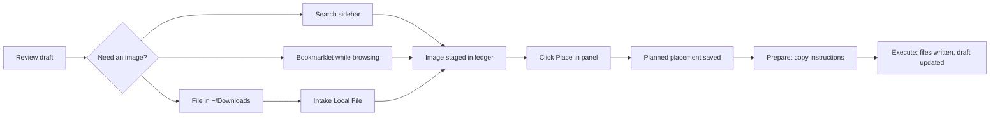
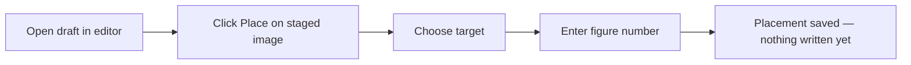

# Image Pipeline Quickstart

Use this when you want the shortest path from an image idea to a placed figure in your draft.

The **image ledger** tracks possible images, why you need them, where they should go, and what should happen next. It runs as a local Cloudflare Worker backed by a D1 database. Some command names say "notebook" — that refers to the same thing.

The pipeline keeps file writes, Git commits, and draft edits behind a confirmation step. You can plan a placement and inspect the instructions before anything touches your files.

## Setup

1. Start the ledger Worker locally:

   ```bash
   npm run ledger:dev
   ```

   This starts Wrangler on port 8787 (Wrangler's default). Leave this terminal running.

2. In VS Code settings, set `oatImages.ledgerApiUrl` to `http://127.0.0.1:8787`.

3. `oatImages.ledgerApiToken` is only needed if your deployed Worker requires authentication. Skip it for local development.

4. Optionally install the [D1 image capture bookmarklet](../../tools/bookmarklet/README.md) for one-click image capture while browsing.

5. `oatImages.imagesRepoPath` defaults to `~/dev/images`. Set it only if your images repo is elsewhere.

6. Open the target markdown draft in VS Code.

## The Flow



## Seven Frames

**Frame 1: Notice the image opportunity.**

While reviewing the markdown draft, you see a spot where an image should go. If one is already staged in the panel, skip to Frame 3.

**Frame 2: Add an image to the ledger.**

Pick whichever path fits where you are:

- **Inside VS Code:** Use the `OAT Image Staging` sidebar to search Pexels and local `~/Downloads` without leaving the editor.
- **While browsing:** Click the OAT bookmarklet on the image's source page to send it straight to the ledger. This is the best path for web images — the Worker resolves photographer metadata and a direct image URL automatically.
- **Local file in `~/Downloads`:** Run `OAT Images: Intake Local File`. Files with ChatGPT-style names auto-stage with provenance filled in from the filename. Other files ask you to confirm source and license. See [image-provenance.md](image-provenance.md).
- **URL:** Run `OAT Images: Intake URL` to stage a web image directly from a URL.
- **Late visual gap:** Run `OAT Images: Create Review Image Need` to record that a section needs an image without choosing one yet.

> If you want to browse by keyword first, Chrome's `fi<Tab>` shortcut expands to
> `site:unsplash.com OR site:pexels.com OR site:pixabay.com <term>`. Those results
> are for discovery — use the bookmarklet to capture rather than downloading manually.

**Frame 3: Open the staging panel.**

Open the `OAT Image Staging` activity bar icon. Run `OAT Images: Refresh Image Panel` if it looks stale. The panel reads staged images from the ledger and also lets you search Pexels and `~/Downloads` inline.

**Frame 4: Plan a placement.**



With the markdown draft open, click `Place` on the staged image in the panel. Choose `substack`, `carousel`, or `linkedin-post` and enter the figure number. The ledger records the plan — nothing is written to disk yet.

**Frame 5: Confirm the plan.**

Run `OAT Images: List Planned Image Placements` to see what is queued. Pick an entry to inspect or copy its ledger record.

**Frame 6: Copy the placement instructions.**

Run `OAT Images: Prepare Planned Placement Run` and pick the placement. The command copies the full instructions to your clipboard — what image, where it goes, which repo, which placement to update.

You can stop here. The plan is saved in the ledger and the instructions are on your clipboard. Nothing in your files has changed.

**Frame 7: Execute.**

Run `OAT Images: Execute Planned Placement Run`. It asks for confirmation before it:

- writes and commits the image file to the asset repo
- inserts or replaces the figure snippet in your draft
- marks the placement as done in the ledger

## Most Common Path

1. Review the draft until an image opportunity appears.
2. Find an image: search the sidebar, capture with the bookmarklet, intake a local file, or choose an already-staged image.
3. Open `OAT Image Staging` and click `Place`.
4. Run `OAT Images: Prepare Planned Placement Run`.
5. Run `OAT Images: Execute Planned Placement Run` when you're ready to write files.

## Command Reference

All commands run from the Command Palette — `Ctrl+Shift+P` on Linux/Windows, `Cmd+Shift+P` on Mac.

| What you want to do | Command |
| --- | --- |
| Capture a browser image | OAT D1 bookmarklet (in browser, not VS Code) |
| Stage a web image by URL | `OAT Images: Intake URL` |
| Stage a local file | `OAT Images: Intake Local File` |
| Record a visual gap for later | `OAT Images: Create Review Image Need` |
| Refresh the staging panel | `OAT Images: Refresh Image Panel` |
| See open visual gaps | `OAT Images: List Open Image Needs` |
| See staged images | `OAT Images: List Staged Notebook Images` |
| See planned placements | `OAT Images: List Planned Image Placements` |
| Copy placement instructions | `OAT Images: Prepare Planned Placement Run` |
| Write files and place the image | `OAT Images: Execute Planned Placement Run` |

## If Something Feels Off

The extension will tell you what to do in most of these cases, but here's the short version:

- **Panel shows "No staged images":** use the search above to find one, or run `OAT Images: Intake Local File` to add a file from Downloads.
- **Can't reach the ledger:** confirm `oatImages.ledgerApiUrl` is set and `npm run ledger:dev` is running.
- **No placements to prepare or execute:** open the staging panel and click `Place` on a staged image first (Frame 4).
- **Wrong repo path:** the Execute command will offer to open settings — set `oatImages.imagesRepoPath` there.

## Technical Details

- The ledger Worker runs locally via `npm run ledger:dev` (Wrangler, port 8787) or `npm run ledger:dev:node` (plain Node, for when Wrangler's local D1 runtime is unavailable).
- The bookmarklet posts to `POST /captures/image` on the ledger Worker. It does not write to Google Sheets.
- The Worker uses optional `UNSPLASH_ACCESS_KEY` and `PEXELS_ACCESS_KEY` secrets to enrich captured photographer metadata.
- Placement instructions are JSON shaped for `imagePipeline.placeAsset`.

## Where To Read More

- [use-cases.md](use-cases.md) — workflows in more detail
- [image-provenance.md](image-provenance.md) — how provenance works and what the status states mean
- [../dev/image-provider-search-plan.md](../dev/image-provider-search-plan.md) — in-editor provider search plan
- [../dev/image-pipeline-architecture.md](../dev/image-pipeline-architecture.md) — data model, saga, and repo boundaries
- [../../tools/d1/README.md](../../tools/d1/README.md) — Cloudflare D1 Worker setup
